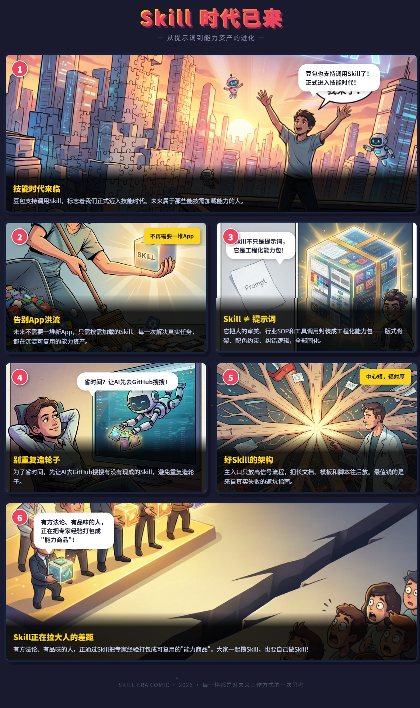

# article-to-comic-skill

AI Skill - 一键将文章转换为漫画 | One-click article to comic converter

## DEMO

下面是使用本 Skill 生成的漫画示例：「Skill 时代已来」

> 豆包也支持调用Skill了，感觉这是正式进入技能时代啦。
>
> 未来，我们不需要一堆新App，只需要按需加载的Skill。每一次解决真实任务，都不只是完成工作，而是在沉淀可复用的能力资产。
>
> 大家一起攒Skill，还有也要自己做Skill
>
> 如果为了省时间，可以先让AI去GitHub里搜搜有没有现成的，可以免的重复造轮子

Skill不只是提示词，它是把人的审美、行业SOP和工具调用封装起来的工程化能力包。比如爆款PPT Skill，核心不是“生成PPT”，而是把设计师的版式骨架、配色约束和后验纠错逻辑固化进去，让AI在高质量约束下填充内容。

好Skill的架构是“中心短，辐射厚”：主入口只放高信号流程，把长文档、模板和脚本往后放。最值钱的不是正向指令，而是来自真实失败的gotchas（避坑指南）。

有方法论、有品味的人，正通过Skill把自己的专家经验打包成可复用的“能力商品”。Skill正在拉大人的差距。
